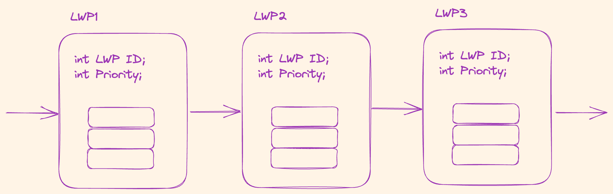
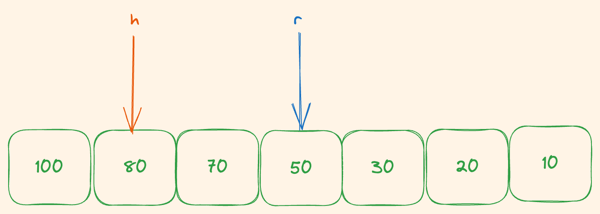
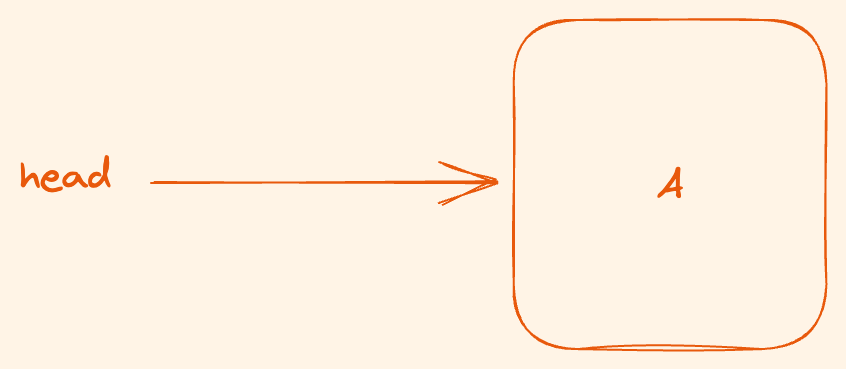

1. design class from this picture ( no need to implement code in stack operataion)
   


``` c++
class Stack {
  // write property and method
}

class LWP {
  // write property and method
}

```

<hr/>

2. write output from this code 

``` c++
int arr[10] = {1, 2 , 3, 4, 5, 6};
int temp = arr[1];

for (int i = 1; i < 9; i++) {
  arr[i] = arr[i+1];  
}
arr[10] = temp;

for (int j = 0; j < 10; j++) {
  cout << arr[i] << "-";
}

```

<hr/>

3. To print odd number, what values should `A`, `B` and `C` `D` be.

``` c++
int arr[3][3] = {{1, 2, 3, 4}, {5, 6, 7, 8}, {9, 10, 11, 12}};

for (int i = 0; i < A; i += 2) {
    for (int j = 0; i < B; i += D) {
    cout << C << "-";
}
```

<hr/>

4.  hash function $h(x) = (x + i)%7$  where x is key and i is number of colision.
   value =  `11`, `12`, `121`, `114`, `14`
   what should hash table look like

| 0            | 1            | 2            | 3            | 4            | 5            | 6            |
| ------------ | ------------ | ------------ | ------------ | ------------ | ------------ | ------------ |
| insert value | insert value | insert value | insert value | insert value | insert value | insert value |

<hr/>

5. Seperate chaining hash table $h(x) = (x + i)%7$    where x is key and i is number of colision.
  value =  `11`, `12`, `121`, `114`, `1`
  what should hash table look like

| 0            | 1            | 2            | 3            | 4            | 5            | 6            |
| ------------ | ------------ | ------------ | ------------ | ------------ | ------------ | ------------ |
| insert value | insert value | insert value | insert value | insert value | insert value | insert value |

<hr/>
6.  after these operations, what is the value of `h` and `r`.



```c++
enqueue(100);
enqueue(200);
enqueue(300);
dequeue;
dequeue;
dequeue;
dequeue;
```

<hr/>

1. given pointer `head` that point to first node assume there is a node in linked list. Write statement to insert at head.

``` c++
class Node {
  int data;
  Node* next;
} 

Node *head;
```

<hr/>

8. given pointer `head`  that point to first node and `tail`  that point to last node. Assume there are  node in linked list. Write statement to insert at last.

``` c++
class Node {
  int data;
  Node* next;
} 
```

<hr/>

9. given pointer `head`  that point to first node and `tail`  that point to last node. Assume there are  node in linked list. Write statement to insert at last.

``` c++
class Node {
  int data;
  Node* next;
} 
```

 <hr/>

10.  from these psudo code, answer 10.1 and 10.2

``` c++
1. check queue full
2. check queue empty
3. tail += 1
4. arr[tail] = data
5. data = arr[tail]
6. arr[front] = data
7. front -= 1
```

10.1  choose and order the operation to `Enqueue`
10.2  choose and order the operation to `Dequeue`

 <hr/>

11.   this is queue implement by using doubly linked list ,from these psudo code answer 11.1 and 12.2

``` c++
1. newNode = head
2. newNode = tail
3. tail -> prev = newNode
4. tail -> prev = newNode
5. head -> next = newNode
6. head -> prev = newNode
7. head = head -> next
8. tail = tail -> prev
9. newNode -> next = tail
10. newNode -> prev = head
11. newNode -> prev = tail
12. newNode -> head = head
```

11.1  choose and order the operation to `Enqueue`
11.2  choose and order the operation to `Dequeue`

<hr/>

12. draw a result of linked list after all operations exercute. (if operation is out of index, do nothing)



```c++
insert 'A' before index 0;
insert 'B' before index 0;
insert 'C' before index 50;
insert 'D' after index 2;
insert 'F' after index 3;
remove index 2;
```
<hr/>

13.   this is timetable of each process with arrived time and computation time, write start time of each process.

| process name | arrived time | commutation time |
| ------------ | ------------ | ---------------- |
| A            | 7            | 7                |
| B            | 0            | 5                |
| C            | 4            | 9                |
| D            | 2            | 2                |
| E            | 8            | 1                |


<hr/>

14. transform from infix notation to prefix notation

14.1 $A - B * C * D / (E - F * J) + Z$
14.1 $(E - Y + C) / A + B$

<hr/>

15. transform from prefix notation to infix notation

15.1 $CS*S/OF-U+$
15.2 $CKI*NG-HA*RD/$

<hr/>

16. what data structure is suitable for these  following application 


| Application              | Stack | Queue |
  | ------------------------ | ----- | ----- |
  | Reverse Polish           |       |       |
  | Downloading web contents |       |       |
  | Function calls           |       |       |
  | Signal Transportation    |       |       |
  | Assembly language        |       |       |
  | Process Management       |       |       |
  | Image Rendering          |       |       |