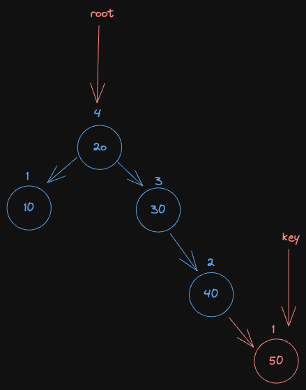

## AVL Tree 

- the different between height of parent and node not greater than 1
- structure : BST + Balanced Structure

### Operation

1. [insertion](#insertion)
2. [deletion](#deletion)
3. [searching](#searching)

### Rotation

1. Left rotation
  - When right subtree is not balanced

2. Right rotation
  - When Left subtree is not balanced

3. Left-Right rotation
  - Right rotation take place first then Left rotation

4. Right-Left rotation
  - Left rotation take place first then Right rotation
  

### Application
1. Use in database in efficient store and search.
2. Optimize search

### Advantage

1. Fast searh 
2. Self Balanced so Height cannot exceed log( N )
   
### Disadvantage

1. Complicated
2. Take more process to balanced
3. Dificult to implement

### Insertion
1. Insert like BST
2. when recursive is rewinding adjust height
3. check left and right height of subtree
4. if balance not equal then.
   1. `leftHeight - rightHeight > 1` and `key < root->left->key` then `rotate right`
   2. `leftHeight - rightHeight < -1` and `key > root->right->key` then `rotate left`
  
   3. `leftHeight - rightHeight > 1` and `key > root->left->key` then `rotate right left`
   4. `leftHeight - rightHeight < 1` and `key < root->right->key` then `rotate left right`
5. After rotate, adjust height by +1 to the greatest of the height of left or right subtree 

### deletion
1. Do delete operation like BST
2. After delete, check balance
3. if it not balance then do similar to insertion condition but change and condition to from check key to check balance of left or right node.
```js
Example

int getBalance( Node *root) {
  return root->left->height - root->right->height;
}

int balance = getBalance(root);

if( balance > 1 && getBalance(root->left) >= 1) {
  return rotateRight(root);
}

if( balance > 1 && getBalance(root->left) <= -1) {
  root->right = rotateLeft();
  return rotateRight(root);
}
```


