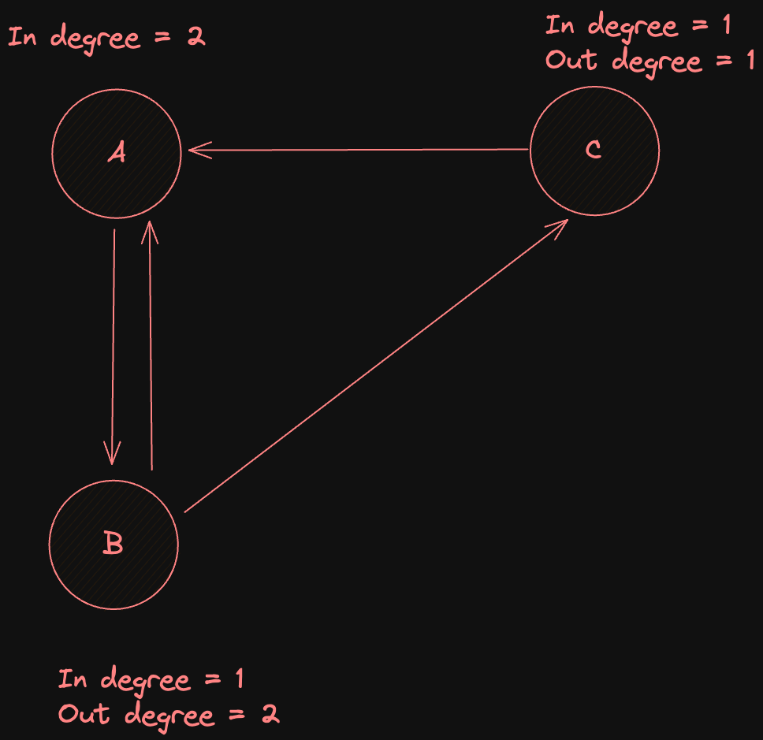
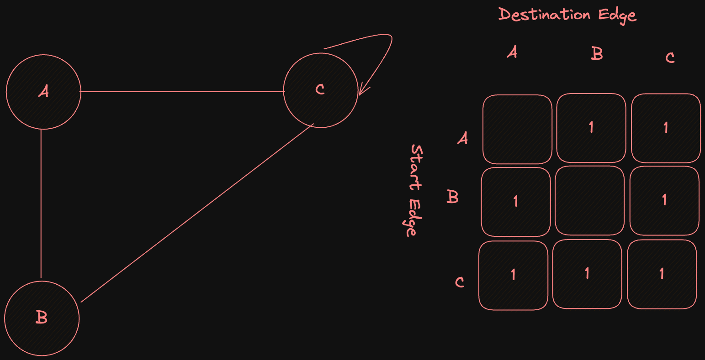
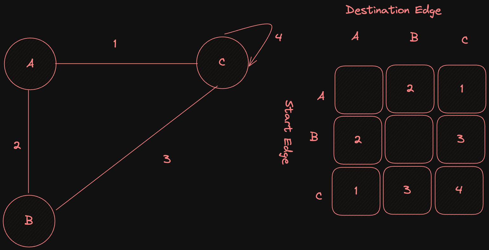

### **Tuesday 10 October 2566**

วันสอบปฎิบัติ 2 : _8 พฤศจิกายน_

### Final Test Guildline

1. Graph 
   1. Breadth First Search
   2. Depth First Search
   3. Connected Component 
2. Avl Tree
3. Binary Search Tree
4. Heap
5. บท 1 - 5 **จะนำมาประยุกต์ในข้อสอบนี้**

### Degree
- degree is number of edge that connect vertex

- in degree and out degree ( when that graph is directed graph)

### Represent Graph
1. Using 2 dimensional array we call `Adjacency Matrix`
- Dimensional arry should be symmesty.
  

- if Graph is directed, dimensional array not garuntee 100% symmesty.
- ตารางเก็บ Vertex เเละ ตารางเก็บ Edge เรารู้เเค่ตารางเก็บ Edge
- ข้อสอบอาจารย์บอกถ้า Vertex เป็นชื่อเมือง

Adgency Graph ของ Weighted Graph

**ระวัง** ถ้าโจทย์มี weight 0 , no edge เราต้องเปลี่ยนเลขนะ

- ขนาดของ Matrix =  $Vertex^2$
- ดังนั้น Adjency list เหมาะกับ graph ขนาดเล็ก
- อีกวิธีนึงสำหรับ Represent Graph

2. Adjency Linkedlist

### Operation
 
1. Depend on data strucutre

2. Traversal 
   - ไม่กลับมา Node เดิม
   - การ traversal ต้องไม่คำนวณซ้ำ
   - DFS
      2.1 Depth First Search เป็นการสร้าง Path* 
      2.2 ใช้ STACK
   - BFS
      2.3 Breadth First Search Edge ใหม่ เเละ Vertex ใหม่
      2.4 ใช้ Queue
    ใน 2 algo นี้ควรจะมี Manager(Loop) ครอบเพื่อเช็คทุก component หรือ Island

Path คือ Edge เเละ Vertex ไม่ซ้ำ

Connected = เลือก Node 1 Node เเล้วต้องไปได้ทั้งหมด ต้องระวังเลยใน Directed **Graph**

### Depth First Search
- undirected
  - Tree edge : any edge use in a tree
  - Back edge : any edge that is not use
- transform a walk to binary tree

### Breadth First Searcj
- undirected 
  - Tree edge : any edge use in a tree
  - Cross Edge : edge that is cross

### Lab 17/10/2566
1. Find tree edge, back edge from DFS undirected graph
2. Find tree edge, cross edge from BFS undirected graph